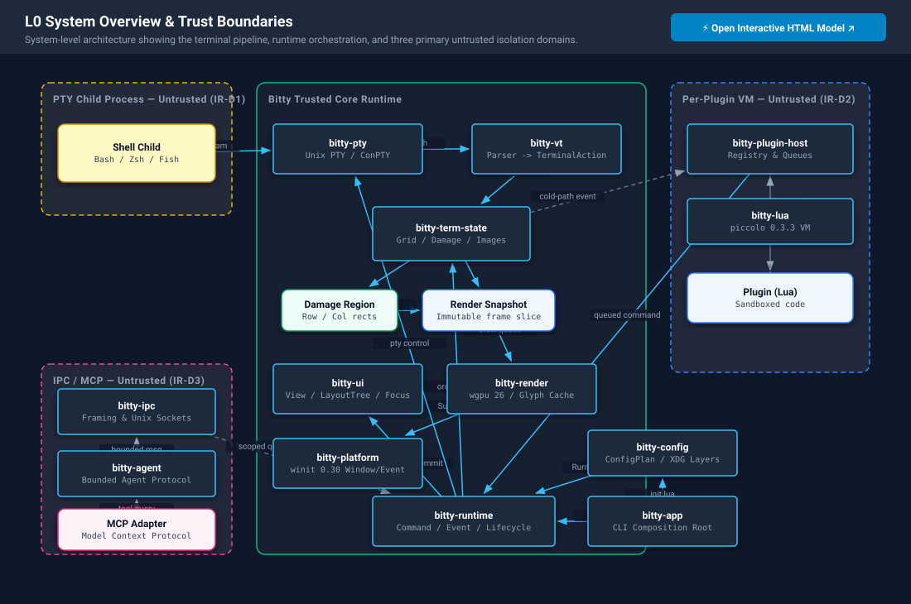

# Architecture Overview

## Status and scope

This document describes Bitty's target architecture, not yet stable product
behavior. Component names remain architecture vocabulary: the Rust core,
primary Lua configuration and plugins, cross-platform goal, plugin-oriented
product direction, and the accepted package lifecycle model are `Accepted`;
most layers and data flows below are `Accepted` via RFCs with lifecycle
`Specified -> Accepted -> Implemented -> Verified -> Compatible -> Release-ready`
per the [risk evidence RFC](../specifications/risk-evidence-rfc.md). Tail
crates remain `Implemented` not yet `Verified` and do not imply shipped or
compatibility-guaranteed behavior.

Time-bound implementation state — crate counts, revisions, releases, test
evidence, and milestone assessments — is not pinned here. The workspace
topology and dependency edges are fixed in
[ADR 0003](https://github.com/bitty-terminal/bitty-docs/blob/main/docs/decisions/adrs/ADR-0003-core-workspace-topology.md)
and `bitty/Cargo.toml`; current counts, revisions, and assessments live in
[project-state.json](https://github.com/bitty-terminal/bitty-docs/blob/main/docs/project/project-state.json)
and the
[open-question register](https://github.com/bitty-terminal/bitty-docs/blob/main/docs/decisions/open-questions.md),
which this document links to instead of duplicating.

## Overall model

```text
                         bitty app
                             |
                     runtime orchestration
             command / event / service / lifecycle
                             |
        +--------------------+--------------------+
        |                    |                    |
        v                    v                    v
   UI model             Terminal core         Platform
 view/layout/focus      VT/grid/image          window/input
        |                    |                    |
        +----------+---------+---------+----------+
                   |                   |
                   v                   v
                Renderer              PTY
              font / GPU          Unix / ConPTY

     init.lua candidate                 Lua plugins
             |                              |
             v                              v
         ConfigPlan                 Extension API
             +-------------+----------------+
                           v
                     bitty runtime

               debug instrumentation
                           |
                           v
                  debug protocol / IPC
                     /       |       \
               DevTools     CLI      MCP adapter
```

> [!TIP]
> **Interactive Architecture Visualizations**:
>
> - **[Interactive Architecture Explorer Hub](interactive/index.html)** — full suite of 13 interactive HTML models with layer filters and inspection drawers.
> - **[L0 System Overview & Trust Boundaries (Interactive)](interactive/00-overview.html)**
> - **[L1 Core Workspace DAG (Interactive)](interactive/01-core.html)**
> - **[L1 Plugin Platform & VM Sandbox (Interactive)](interactive/02-plugin-platform.html)**
> - **[L1 Workspace Compositor & Panel Architecture (Interactive)](interactive/03-panel-system.html)**
>
> [](interactive/00-overview.html)

## Candidate architecture invariants

The following invariants come from the architecture discussion. They are
recommended starting points for later RFCs and ADRs, not approved implementation
designs. The [Security Overview](https://github.com/bitty-terminal/bitty-docs/blob/main/docs/security/overview.md) has promoted the rule
that plugins cannot enter the terminal, render, or input hot paths into a
normative constraint; the exact execution domains remain candidates.

### Separate Terminal, View, and Layout

- **Terminal** owns the PTY and process, VT state, grid, scrollback, modes, and
  terminal-level metadata.
- **View** references a Terminal and owns viewport, selection, and presentation
  state.
- **Layout** arranges UI primitives such as View, split, stack, overlay, focus,
  and resize.

The design must not freeze `Pane = PTY = Terminal = UI` into a single object.
After separation, multiple Views can present the same Terminal, while the model
also preserves space for future detach and attach, session persistence, and a
remote UI. Those future capabilities are not themselves commitments.

Implementation note (`bitty` PR #1485, `d2ccd64`; `Implemented`, not
`Verified`): pointer- and keyboard-driven presentation state is keyed by the
owning View, not by the primary terminal grid.

- The selection is owned by exactly one `ViewId` and read from that View's
  own grid.
- Pointer hit testing resolves the topmost View in paint order. Mouse reports
  are encoded in the receiving (focused) View's own cells, clamped at its
  edge. A left press on another View moves focus there first when either
  terminal tracks the mouse.
- Copy mode and search are bound to the View they started in.
- Output attribution lets a View-bound consumer react only to its own
  Terminal's output.
- Every consumer fails closed when its View no longer resolves to a live grid
  in the active layout.

This is the View/Terminal separation above applied to presentation state. The
candidate model would therefore key selection per View, not per Terminal, if
one Terminal is later presented by several Views. The contract and evidence
are in the
[Input and Pointer Contract](../specifications/input-pointer-rfc.md) and the
[TerminalRegistry and View Lifecycle Contract](../specifications/terminal-registry-view-lifecycle-rfc.md).

### Separate the parser from Terminal State

The VT parser converts a byte stream into semantic `TerminalAction` values.
The terminal state machine then applies each action and produces damage, events,
and replies. The parser does not modify renderer or plugin state directly.

This boundary allows independent parser benchmarks, fuzzing, replay, and
differential testing. It also prevents protocol parsing and product behavior
from contaminating each other.

### Separate image protocols from rendering

Image protocol decoding should not create GPU textures directly. The candidate
model normalizes Kitty Graphics, Sixel, and iTerm2 image input into
`ImageStore` and `ImagePlacement`, which then enter the scene or render
snapshot.

The architecture must preserve `Image != Cell`. Image identity, placement,
anchors, clipping, stacking, and scrolling semantics must not be prematurely
compressed into ordinary cells. Which image protocols enter the initial set
remains a roadmap decision. The candidate
[Graphics and Appearance Model](graphics-appearance.md) extends this boundary
to backdrop, opacity, blur, background, theme, and crate guidance.

### Lower layers know nothing about higher layers

Dependencies must form a one-way DAG. Typical prohibited dependencies include:

- the VT layer depending on runtime or core orchestration;
- the Terminal layer depending on the UI or plugin host;
- the renderer reading Terminal private structures;
- the Font or Platform layer depending on the application layer;
- a plugin or DevTools holding a GPU object, window object, PTY file descriptor,
  or internal Rust object directly.

## Key data flows

### Output hot path

```text
Shell -> PTY -> byte batch -> VT parser -> TerminalAction
                                      -> Terminal state
                                           |       |
                                           |       +-> replies -> PTY
                                           v
                                         Damage
                                           |
                                           v
                                    Render snapshot
                                           |
                                           v
                                        Renderer
```

Lua does not enter this path. Terminal events reach the plugin runtime through a
bounded, observable side queue:

```text
Terminal state -> cold-path event -> plugin runtime -> command queue -> runtime
```

### Input path

```text
Platform input -> Rust input router -> keymap table
                         |                  |
                         |                  +-> Command registry
                         v
                  terminal encoder -> PTY
```

Plugins register with the keymap and command registries during loading or
configuration. They should not receive every raw keydown and decide on each
occasion whether propagation may continue.

### Configuration path candidate

```text
ephemeral Config Lua VM -> declarative ConfigPlan -> Rust validation
                                            -> diff/reconcile -> RuntimeConfig
```

This two-phase model allows a failed hot reload to keep using the previous
configuration and prevents each evaluation of `init.lua` from causing
irreversible side effects. Lua as the primary configuration language is
accepted. `ConfigPlan`, a possible static auxiliary entry point, the Config VM
lifecycle, and the schema mechanism still require an ADR.

## Candidate logical component responsibilities

| Component      | Primary responsibilities                                                       | Explicitly not responsible for                |
| -------------- | ------------------------------------------------------------------------------ | --------------------------------------------- |
| App            | CLI, startup, and window/process lifecycle                                     | VT semantics and plugin-private logic         |
| Runtime        | Managers, Command, Event, Service, and stable IDs                              | A concrete parser or GPU backend              |
| VT             | Byte state machine and CSI/OSC/DCS/APC-to-action conversion                    | Grid, PTY, Lua, and windows                   |
| Terminal       | Grid, cursor, modes, scrollback, hyperlinks, semantic zones, and damage        | GUI, GPU, and Lua                             |
| Image          | Protocol-adapted image and placement model                                     | Choosing a GPU backend directly               |
| Input          | Keyboard/mouse encoding and keymap mechanisms                                  | Plugin UI policy                              |
| PTY            | Unix PTY and Windows ConPTY abstraction                                        | Terminal parsing and UI                       |
| Platform       | OS boundaries for windows, IME, DPI, clipboard, monitors, and related services | Leaking winit or native types to other layers |
| Font           | Discovery, fallback, shaping, rasterization, and glyph cache                   | UI policy                                     |
| Render         | Scene, snapshot, damage, and GPU/software backends                             | Reading Terminal private mutable state        |
| UI             | View, Layout, Overlay, and Focus primitives                                    | Concrete policy such as tabs or workspaces    |
| Plugin host    | Discovery, capabilities, lifecycle, lazy loading, and HMR                      | Entering byte, cell, or glyph hot paths       |
| Debug protocol | Stable, structured, versioned inspection interface                             | Binding to MCP or a particular DevTools UI    |

These are logical boundaries. The final crate granularity should follow
dependency direction, independent testing value, and compilation cost. It
should not turn every source module into a crate. The adopted workspace
decomposition and dependency edges are fixed in
[ADR 0003](https://github.com/bitty-terminal/bitty-docs/blob/main/docs/decisions/adrs/ADR-0003-core-workspace-topology.md);
`bitty-package` lifecycle and integrity model is `Accepted` (OQ-021) with
signatures still draft, `bitty-lua` `Accepted` (OQ-009/030-032; runtime
successor direction recorded in [ADR 0012](https://github.com/bitty-terminal/bitty-docs/blob/main/docs/decisions/adrs/ADR-0012-phodopus-runtime.md),
still on `piccolo` 0.3.3), and the tail
crates (`bitty-rich` OQ-008/015/016, `bitty-ipc`/`bitty-agent` OQ-018) are
`Implemented` but not yet `Verified`, implementing the tail of the
[Proposed Delivery Sequence](../product/proposed-delivery-sequence.md) as
headless libraries without expanding the accepted topology until `Verified`.
Current revision and milestone evidence lives in
[project-state.json](https://github.com/bitty-terminal/bitty-docs/blob/main/docs/project/project-state.json).

## Candidate execution-domain model

The current recommendation distinguishes at least the following logical
execution domains, but the thread count remains undecided:

- **PTY I/O**: batch reads and writes and handle platform concerns such as
  blocking Windows pipes.
- **Terminal**: parse bytes and update terminal state.
- **Renderer**: consume stable snapshots and damage without blocking the PTY or
  Terminal domain.
- **Plugin**: consume cold-path events and produce commands without holding a
  mutable Terminal reference.
- **Background services**: network, SSH, MCP, and similar work may use a separate
  asynchronous runtime.

The core should remain asynchronous-runtime agnostic. Whether to adopt Tokio and
where to use it are candidate decisions. The entire system should not become
asynchronous merely for a small number of network tasks.

## Extension and debugging boundaries

The source of truth for the Plugin API should belong to the core repository. A
separate plugin SDK provides Lua helpers, type hints, a mock host, test tools,
and generated documentation, but cannot define the core contract in reverse.

Similarly, the debug protocol belongs inside the core boundary, while the
DevTools UI and MCP adapter are independent consumers:

```text
internal instrumentation -> versioned debug protocol
                                   |
                    +--------------+--------------+
                    |              |              |
                DevTools          CLI             MCP
```

MCP is an adapter, not an internal protocol. This allows an Agent to inspect
structured state without making the core depend on a particular generation of
Agent tooling. Permissions for MCP, Agents, and DevTools follow the
[Threat Model](https://github.com/bitty-terminal/bitty-docs/blob/main/docs/security/threat-model.md).

## Host gateway surface (Phase-A mechanism)

Status: `Implemented` mechanism record, not an accepted contract change.
The five services below are shipped mechanism in `bitty-ipc` on `bitty`
main; the reconciliation note is a draft design record in `bitty`.
Wire and bridge publication plus live Runtime wiring are sequel work and
are not claimed here. Accepted ownership tables in
[Core and Plugin Boundaries](core-boundaries.md) are unchanged.

Direction:
[DIR-018](https://github.com/bitty-terminal/bitty-docs/blob/main/docs/decisions/index.md)
develops `bitty-ai` and the Bitty Host Capability Gateway in parallel and
converges at the Bridge. Phase A delivers host primitives in dependency
order; the parenthetical task numbers inside DIR-018 are working-direction
placeholders and the delivered task numbers below are what merged.

| Phase-A item                                          | `bitty` mechanism (link, not copy)                                                                                                                                                         | Delivery                                                                    |
| ----------------------------------------------------- | ------------------------------------------------------------------------------------------------------------------------------------------------------------------------------------------ | --------------------------------------------------------------------------- |
| Bounded `terminal.snapshot` read service              | [snapshot.rs](https://github.com/bitty-terminal/bitty/blob/main/crates/bitty-ipc/src/snapshot.rs) host read service behind the scope registry                                              | CTX-0420, [bitty PR #703](https://github.com/bitty-terminal/bitty/pull/703) |
| Host tool dispatch with consent                       | [tool_dispatch.rs](https://github.com/bitty-terminal/bitty/blob/main/crates/bitty-ipc/src/tool_dispatch.rs) routing plus authorization, consent, target, budget, attribution, and outcome  | CTX-0421, [bitty PR #705](https://github.com/bitty-terminal/bitty/pull/705) |
| Generic execution backend with Unknown reconciliation | [execution.rs](https://github.com/bitty-terminal/bitty/blob/main/crates/bitty-ipc/src/execution.rs) supervised execution with reconcile-before-re-execution semantics                      | CTX-0442, [bitty PR #707](https://github.com/bitty-terminal/bitty/pull/707) |
| Publishable bridge client boundary                    | [bridge.rs](https://github.com/bitty-terminal/bitty/blob/main/crates/bitty-ipc/src/bridge.rs) out-of-process client composing registry, scope, consent, budget, and envelope               | CTX-0419, [bitty PR #709](https://github.com/bitty-terminal/bitty/pull/709) |
| Rich fragment transport, text-first                   | [rich_fragment.rs](https://github.com/bitty-terminal/bitty/blob/main/crates/bitty-ipc/src/rich_fragment.rs) bounded fragment ingestion queue                                               | CTX-0422, [bitty PR #711](https://github.com/bitty-terminal/bitty/pull/711) |
| AI-surface reconciliation design                      | [ai-surface-reconciliation.md](https://github.com/bitty-terminal/bitty/blob/main/specifications/ai-surface-reconciliation.md) draft mapping of AI-named Core items to generic counterparts | CTX-0423, [bitty PR #702](https://github.com/bitty-terminal/bitty/pull/702) |

Sequel, explicitly not claimed: wire-method publication, bridge crate
publication beyond the mechanism boundary, live Runtime wiring of the five
services, fragment-to-`RichBlock` projection in `bitty-rich`, and any new
scope or capability acceptance. The accepted
[IPC and Agent RFC](https://github.com/bitty-terminal/bitty-ai-docs/blob/main/specifications/ipc-agent-rfc.md)
(OQ-018) is unchanged by this record; OQ-066 stays open.

## Candidate long-term evolution

- A headless runtime in which Terminal, PTY, and the plugin host do not depend on a GUI (accommodated early per [ADR 0008](https://github.com/bitty-terminal/bitty-docs/blob/main/docs/decisions/adrs/ADR-0008-headless.md); headless runtime is prerequisite to any daemon, deferred daemon does not imply remote UI).
- `bittyd` owning multiple Terminals and allowing GUI, CLI, or remote clients to attach. Deferred to post-v1.0 with trust-boundary gate per [ADR 0008](https://github.com/bitty-terminal/bitty-docs/blob/main/docs/decisions/adrs/ADR-0008-headless.md), closing [OQ-020](https://github.com/bitty-terminal/bitty-docs/blob/main/docs/decisions/open-questions.md); see [Candidate daemon staging](../product/proposed-delivery-sequence.md) and the candidate [Remote Infrastructure and Remote Client](../specifications/remote-infrastructure-candidate.md) direction.
- A record and replay format that reproduces parser, resize, image, and rendering
  problems from deterministic input.
- A software renderer as a fallback path for CI, snapshot tests, GPU failures,
  and remote desktops.

These directions affect present boundary design but are not delivery
commitments for the first version.

See [Core and Plugin Boundaries](core-boundaries.md) for finer responsibility
splits and the
[Technology and Dependency Strategy](https://github.com/bitty-terminal/bitty-docs/blob/main/docs/project/technology-strategy.md) for the
status of technology choices.
